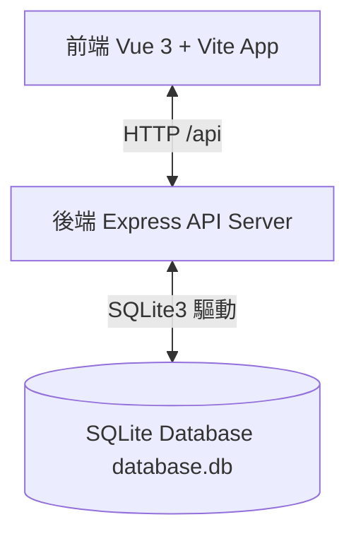
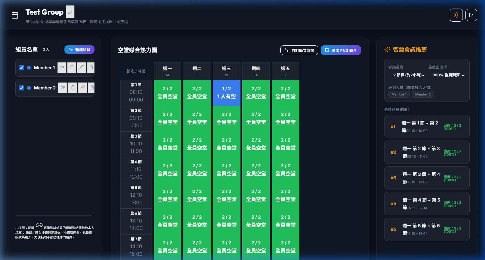

# 🚀 大學課表空堂媒合器：從零開始的前後端實作教學指南

> 💡 **這是一份完整的實作與教學說明文件，旨在說明如何從零建立一個具備「課表字串解析」、「空堂熱力圖」與「實時同步」的開會時間協調系統。閱讀完此文件後，任何人都能理解並學會如何動手做出來！**

---

## 📌 網站標題與專案簡介
* **網站標題**：`大學課表空堂媒合器 | 團隊開會/活動時間排程助手`
* **核心價值**：解決大學生、專題小組及社團在安排開會時間時，需要逐一比對課表的痛點。組員只需一鍵複製校務系統的課表並貼上，系統即可自動解析空堂，並實時彙整生成「空堂熱力圖」。

---

## ⚙️ 系統架構設計

本系統採用 **前後端分離 (Client-Server)** 與 **輕量資料庫** 架構，以確保資料的持久性與實時同步：



* **前端 (Client)**：`Vue 3` (使用組合式 API - Composition API) + `Vite` 開發。採用原生 CSS 進行擬物玻璃摩登設計 (Glassmorphism)，無外部路由套件，採輕量動態查詢參數控制頁面。
* **後端 (Server)**：`Node.js` + `Express`。提供 RESTful API，負責群組建立、組員新增、課表同步等業務。
* **資料庫 (Database)**：`SQLite` 本地檔案資料庫。以關聯式表單儲存群組、成員、自訂節次及課表佔用狀態。

---

## 🗄️ 步驟一：後端資料庫與 API 實作

### 1. 資料庫表格設計 (`database.js`)
我們使用 SQLite 來儲存資料，共建立四個核心資料表：
* **`groups`**：存放小組 ID 與小組名稱。
* **`periods`**：存放自訂的課表節次（例如第一節 08:10 - 09:00）。
* **`members`**：存放小組成員代稱、代表顏色、是否啟用。
* **`busy_slots`**：存放組員的忙碌/課堂時段，以「星期 + 節次」作為關聯主鍵。

```sql
-- 成員忙碌時段表結構
CREATE TABLE IF NOT EXISTS busy_slots (
    id INTEGER PRIMARY KEY AUTOINCREMENT,
    member_id TEXT,
    day TEXT,          -- 'M', 'T', 'W', 'TH', 'F', 'S', 'SU'
    period_id TEXT,    -- 節次 ID (如 'p1', 'p2')
    reason TEXT,       -- 課程名稱或忙碌原因 (選填)
    FOREIGN KEY(member_id) REFERENCES members(id) ON DELETE CASCADE
);
```

### 2. 後端核心路由實作 (`server.js`)
後端透過 RESTful APIs 提供前端資料存取：
* `POST /api/groups`：建立全新小組，並初始化預設的 5 天 9 節課表。
* `GET /api/groups/:id`：取得小組的完整資料，包含組員列表、各節次以及所有人目前的忙碌時段。
* `PUT /api/groups/:id/members/:memberId`：即時更新組員的課表忙碌狀態或基本個人資料。

---

## 🎨 步驟二：前端 Vue 3 元件與 UI 實作

前端 UI 採用全黑高科技質感的**玻璃擬態設計 (Glassmorphism)**。核心邏輯分為三個主要區塊：

### 1. 課表文字智慧解析 (`parser.js`)
當使用者從學校選課系統複製課表時，我們透過正則表達式 (Regular Expressions) 智慧匹配時間特徵。例如：
* **規則一（節次代碼）**：匹配 `週二[3,4]` 或 `二3-4`，將其轉換為星期二第 3 節與第 4 節忙碌。
* **規則二（時間範圍）**：匹配 `W(09:10-12:00)`，自動對比節次設定時間，標記對應的節次為忙碌。

### 2. 熱力圖顏色智慧配色 (`ScheduleGrid.vue`)
這是最關鍵的視覺引導設計，系統會依據**有空組員的比例 (Ratio)** 動態設定網格的背景色與邊框：

* ✅ **全員有空 (Ratio = 1.0)**：
  呈現醒目的 **亮綠色** (`#22c55e`)，讓小組快速識別出所有人都能參與的最佳開會時間。
* 🔵 **部分有空 (0.0 < Ratio < 1.0)**：
  統一呈現單一 **亮藍色** (`#3b82f6`)，不使用多層漸層透明度，保持畫面簡潔易讀。
* ❌ **都沒空 (Ratio = 0.0)**：
  **完全不套用任何背景顏色**（即維持預設的半透明灰黑色卡片背景），去除了原本的紅底，避免視覺干擾，讓使用者能專注在有空的時間段。

#### 配色核心程式碼片段：
```javascript
const getCellStyle = (day, periodId) => {
  if (totalActive.value === 0) return {};
  const { free } = getCellStats(day, periodId);
  const ratio = free.length / totalActive.value;
  if (ratio === 1) {
    return {
      backgroundColor: '#22c55e', // 全員有空：亮綠色
      borderColor: '#22c55e'
    };
  } else if (ratio > 0 && ratio < 1) {
    return {
      backgroundColor: '#3b82f6', // 部分有空：統一亮藍色
      borderColor: '#3b82f6'
    };
  }
  return {}; // 都沒空：維持預設無背景色
};
```

---

## 🖥️ 執行流程與畫面導覽（圖文並茂）

以下是小組協調開會時間的完整生命週期與操作流程：

### 流程 1：建立或加入小組 (首頁)
在首頁中，您可以輸入小組名稱快速建立一個空堂媒合小組。系統支援 **「最近訪問的小組」歷史紀錄功能**，會將您建立過或加入過的小組自動儲存在瀏覽器的 `localStorage` 中，下次造訪首頁時即可快速進入，不需擔心找不到已建立的小組！


*圖說：首頁設計，包含快速建立小組的輸入框，以及下方由 localStorage 生成的「最近訪問小組」清單。*

---

### 流程 2：填寫個人課表 (組員編輯頁)
點擊組員列表中的「編輯」或分享專屬連結給特定組員後，即可進入該組員的專屬填寫畫面。
* 提供「智慧貼上課表」按鈕，貼上複製的文字即可一鍵解析。
* 支援**滑鼠按住拖曳劃記**功能，可快速選取多個忙碌時段。
* 網頁右上角與下方均新增了 **「返回總覽」** 按鈕，方便成員填寫完畢後一鍵返回小組熱力圖。


*圖說：個人課表編輯畫面，可選取個人代表顏色，並提供返回小組總覽的按鈕。*

---

### 流程 3：空堂熱力圖與最佳時段推薦 (小組總覽頁)
當組員填寫完畢後，小組熱力圖會以 **輪詢機制 (Polling)** 每隔幾秒自動同步最新資料。
* **綠色網格** 代表「全員有空」，是開會的最佳首選。
* **藍色網格** 代表「部分人有空」，點擊網格可在下方資訊面板查看「誰有空」與「誰在忙碌/課程名稱」。
* 右側的「智慧會議推薦」會自動計算出最長且參與人數最多的空堂時段，並列出推薦順序，支援一鍵匯出 PNG 圖片。


*圖說：空堂熱力圖主畫面。可以看到週一、二、四、五的大部分時段均為亮綠色（全員空堂），而週三第一節有部分組員忙碌，呈現統一的亮藍色，無人有空時則為預設底色。*

---

## 🚀 部署與執行步驟教學

想要在自己的電腦上運行這個專案，只需以下簡單三步：

### 步驟 1：安裝依賴套件
分別在 `server` 與 `client` 資料夾下執行安裝：
```bash
# 後端安裝
cd project/server
npm install

# 前端安裝
cd ../client
npm install
```

### 步驟 2：啟動後端 Express Server
```bash
cd project/server
npm start
```
*後端會啟動於 `http://localhost:3000`，並在 `/project/server/data/database.db` 自動生成 SQLite 資料庫。*

### 步驟 3：啟動前端 Vite Dev Server
```bash
cd project/client
npm run dev
```
*前端會啟動於 `http://localhost:5174`，透過內建的 Proxy 自動將 `/api` 請求轉發至後端的 Port 3000。打開此網址即可開始體驗！*
